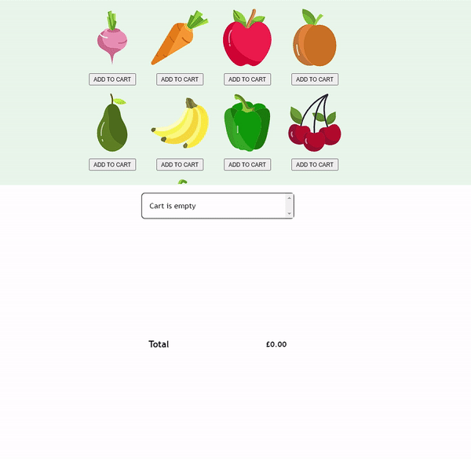

# Angular Greengrocers

## Objectives

Use what you've learned to:

- Fetch a list of groceries from an API
- Allow users to add their desired items to their cart
- Allow users to ammend the quanitity of each item
- Display a total price of the users cart

## The Groceries API

You will be fetching a list of groceries from an external API. [You can read the docs here](https://boolean-api-server.fly.dev/api-docs/#/groceries)

## Setup

- Fork this repo to your own github account
- Clone your forked repo
- Open the project in VSCode
- Open a terminal and run the command `npm install` to install the dependencies

# Extensions

- Add a button to Filter the store items by type
- Add a button to Sort the store items by price
- Add a button to Sort the store items by name
- Covert the app to be multipage.
  - A page for the store
  - A checkout page
